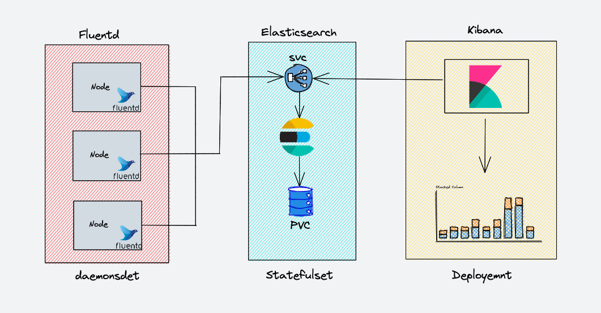

# Elasticsearch + FluentD + Kibana (EFK)
```
Provisioning EFK Stack on Kubernetes Cluster
```

## Architecture


## Environment
```
Kubernetes Cluster
```

## Installation
```
kubectl apply -f ns.yaml
kubectl apply -f es_statefulset.yaml,es_svc.yaml -n logging
kubectl apply -f kibana.yaml -n logging
kubectl apply -f fluentd.yaml -n logging
```

## Access
You can change to cluster IP endpoint and take it easy!
- Elastic Search :
    - kubectl port-forward es-cluster-0 9200:9200
    - http://localhost:9200/_cluster/state?pretty
    - http://localhost:9200/_cat/indices?v
- Kibana :
    - kubectl port-forward <kibana-pod-name> 5601:5601
    - http://localhost:5601/

## Kibana
Lets start monitor logging :
- Goes to Kibana Dashboard
- Click `Discover`
- Click `Create index pattern`
- Fill Name with `logstash-*`
- fill Timestamp filed with `@timestamp`
- Click `Create index pattern`

## Testing logging with BusyBox
```
kubectl apply -f containerlogging -n logging
```
- After Busybox was deployed, monitor it on Kibana
- Goes to `Discover` page
- fill in the search bar with `kubernetes.pod_name:counter`

## Source
- https://azmifarih.medium.com/how-to-set-up-an-elasticsearch-fluentd-and-kibana-efk-logging-stack-on-kubernetes-1c455a6f17a8